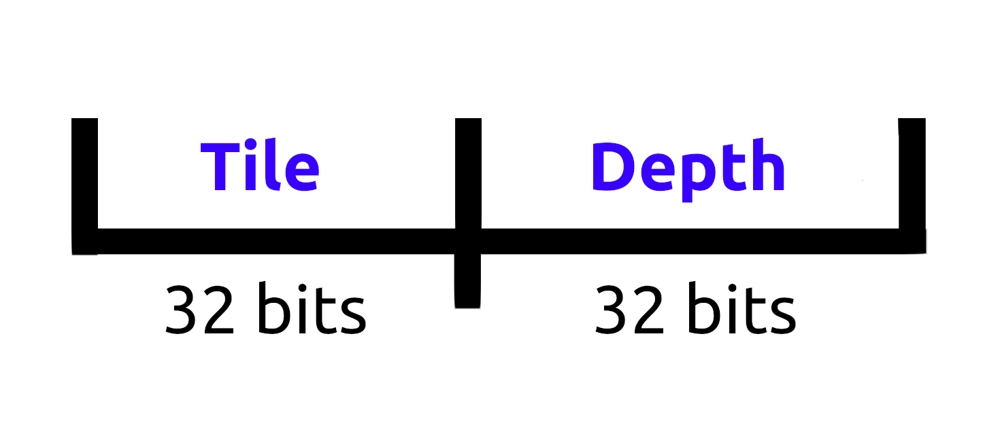

---
author:
- Jesús Bertani Ramírez
bibliography:
- references.bib
date: December 2024
title: Rendering a Frame in Gaussian Splatting
---

Point-Based Rendering and Radiance Fields
=========================================

Methods like NeRF depend on a continuous representation of the space to
be able to reconstruct the scene using ray casting. On the other hand,
point-based rendering methods render disconnected and unstructured
geometry. In their simplest form, it's just rasterizing a set of points
with a fixed size [@grossman1998point]. A problem with this kind of
rendering is that it suffers from holes, causes aliasing, and is
strictly discontinuous. To overcome these limitations, it has been
proposed to \"splat\" the point primitives using ellipsoids, discs, or
surfels to fill an extend larger than a pixel.
[@botsch2005high; @pfister2000surfels; @zwicker2001surface; @ren2002object]

Other alternatives that have been proposed are the *differentiable*
point-based rendering techniques.  [@wang2019differentiable] From them,
the one we are most interested in is point-based $\alpha$-blending,
which works essentially like NeRF volumetric rendering. In that method,
the color given by volumetric rendering along a ray is obtained with:

$$C = \sum_{i=1}^N \alpha_ic_i\prod_{j=1}^{i-1}(1-\alpha_i),$$

where $\alpha_i = (1-\exp(-\sigma_i\delta_i))$. Here, $\delta_i$
represents the size of the intervals between each sample taken on the
ray, from which we get their density $\sigma_i$ and color $c_i$.

Now, a point-based approach computes the color of a pixel by blending
$\mathcal{N}$ ordered points that overlap that pixel:

$$C = \sum_{i\in \mathcal{N}}\alpha_ic_i\prod_{j=1}^{i-1}(1-\alpha_i).$$

This time, $c_i$ represents the color of each point, and $\alpha_i$
is given by evaluating a 2D Gaussian centered in the point, with
covariance $\Sigma$, multiplied by its opacity. This ultimately gives us
its transparency. [@wang2019differentiable] The origin of this formula
will be explained in a posterior section.

Even though they are similar, the nature of the formulas is totally
different. The volumetric rendering makes us take samples over all the
ray, even in zones where there is almost no volume. This causes noise
and has a big computational cost. Alternatively, this point-based method
uses a finite collection of objects which are easier to process, as we
can see in fast-rendering
algorithms [@GaussianSplatting; @lassner2021pulsar; @ruckert2022adop].
Furthermore, as mentioned in [@GaussianSplatting], its unstructured and
discrete nature is perfect to allow the creation, destruction, and
displacement of geometry, which is perfect for scene reconstruction.

Finally, it is worth noting that using 3D Gaussians to represent objects
instead of points had already been done beforehand, as seen in
[@rhodin2015versatile; @wang2023voge]. However, 3DGS was the first to
use them for reconstructing an entire scene.

Differentiable 3D Gaussian Splatting
====================================

Gaussian Splatting, also known as 3DGS, is a procedure designed to
obtain a representation of a real scene starting from a sparse point and
calibrated cameras obtained by SfM [@sfm]. To achieve this, the authors
of the original paper chose to model the geometry as a collection of
unnormalized 3D Gaussianas, which are easy to project onto a 2D plane.

The Gaussianas are defined in Local Space with coordinates
${t} = (t_0, t_1, t_2)^T$ by a *Covariance Matrix* $\Sigma_k$ and
centered at a point $t_k$: 

$$G_{\Sigma_k}(t - t_k) = e^{-\frac{1}{2}(t-t_k)^T\Sigma^{-1}(t-t_k)}.$$

Each Gaussian also has an associated opacity value $\sigma_k$. To allow
a direction-dependent appearance of color, it is represented via
Spherical Harmonics, following standard practice as in
[@Fridovich-Keil2022; @Muller2022]. The 3DGS algorithm proceeds to
create the radiance field representation via optimization of these
parameters, along with the density of the Gaussians. This allows them to
use the point-based approach to compute the color of a pixel via
$\alpha$-blending.

In the following sections, we will discuss some of the most important
steps in this method and how the formulas were derived.

Understanding the Render Equation
---------------------------------

Ultimately, our goal is to project the Gaussians onto a plane to
determine the color of a pixel. In order to do so, 3DGS performs
$\alpha$-blending using the point-based method. Let us examine the origin of this formula.

We define a **'Ray Space'** similar to the approach in
[@zwicker2001ewaVolumeSplatting], by the triplet
${x} = (x_0, x_1, x_2)^T$. Given a camera center and a projection
plane, these three coordinates are interpreted as follows: The pair
$\hat{x}$ $= (x_0,x_1)^T$ specifies a point in the projection plane.
These are also referred to as *screen coordinates* and can be in pixels.
The ray that passes through the camera center and intersects a specific
$\hat{x}$ is called a *viewing ray*. We will also use
$\hat{x}$ to refer to these rays.

The third coordinate, $x_2$, denotes an arbitrary distance relevant to
the projection. For example, in perspective and orthographic projection,
this third coordinate would denote the normalized depth between near and
far planes. In 'Ray Space', although the rays originate from a single
source, they appear parallel.

In [@zwicker2001ewaVolumeSplatting] the volume rendering equation is
presented, which describes the light intensity $I_\lambda($ $\hat{x}$ $)$
at wavelength $\lambda$ that reaches the camera center along the ray
$\hat{x}$ with length $L$: 

$$I_\lambda(\hat{x}) = \int_0^L c_\lambda({\hat{x}},\xi)g({\hat{x}}, \xi)e^{-\int_0^\xi g({\hat{x}},\mu)d\mu}d\xi.$$

Here, $g(x)$ is the *extinction function*, which defines the rate
of light occlusion, and $c_\lambda(x)$ is an *emission
coefficient*. As they wrote, the exponential term can be interpreted as
an *attenuation factor*. Finally, the product
$c_\lambda(x)g(x)$ is also called *source term*, and describes
the light intensity scattered in the direction of the ray $\hat{x}$
at the point $x_2$. For a more detailed explanation of the physical
origin of this formula you can refer to [this excellent
article](https://www.scratchapixel.com/lessons/3d-basic-rendering/volume-rendering-for-developers/volume-rendering-summary-equations.html).

Now, given that we are working with Gaussians, it is assumed that the
extinction function can be expressed as a weighted sum of coefficients
$g_k$ and reconstruction kernels $r_k(x)$. This assumption is
consistent with a physical model where the volume consists of individual
particles that absorb and emit light, represented as:

$$g(x) = \sum_{k} g_kr_k(x).$$

substituting this into the volume rendering equation, we obtain: 

$$I_\lambda(\hat{x}) = \sum_{k}\left(\int_0^L c_\lambda(\hat{x},\xi)g_kr_k(\hat{x},\xi)\prod_j e^{-g_j\int_0^\xi r_j(\hat{x},\mu)d\mu}d\xi\right).$$

As explained in the article, to be able to compute this function
numerically, splatting algorithms rely on several simplifying
assumptions. First, it is assumed that the reconstruction kernels
$r_k(x)$ have local support. The splatting approach also assumes
that these support areas do not overlap along the ray $\hat{x}$ and
that they are sorted from front to back. Additionally, the emission
coefficient is assumed to be constant within the support of each kernel
along the ray.

To account for view-dependent effects, we go an step further and assume
that the emission coefficient is constant over the entire support, given
the direction from the camera center to the particle's position. We
denote this as $c_{k}(d_k) = c_\lambda($ $\hat{x}$ $, x_2)$,
where $($ $\hat{x}$ $, x_2)$ is in the support of $r_k$ and $d_k$ is
said direction that changes from particle to particle.

Finally, the exponential function is approximated using the first two
terms of its Taylor expansion, and self-occlusion is ignored. Under
these assumptions, we can rewrite the previous equation as:

$$I_\lambda(\hat{x})  = \sum_k c_{\lambda k}(\hat{x})g_kq_k(\hat{x})\prod_{j = 0}^{k-1}(1-g_jq_j(\hat{x})),$$

where $q_k($ $\hat{x}$ $)$ denotes an integrated reconstruction kernel,
defined as: 

$$q_k(\hat{x}) = \int_\mathbb{R} r_k(\hat{x}, x_2)dx_2.$$

This function forms the foundation of all splatting algorithms. We can
see that in the original equation that we gave for this method, ${c}_k$ corresponds to the term
$c_k(d_k)$ and that $\alpha_k = g_kq_k($ $\hat{x}$ $)$.

Given that we chose Gaussians as kernels, estimating $r_k(x)$
reduces to evaluating the Gaussian $k$ along the viewing ray. Notice
that our Gaussians are defined in Local Space but our formulas are all
in 'Ray Space', so we first have to transform them. These
transformations will be covered in the next section. Once we understand
them, we will revisit the definition of $\alpha_k$ for Gaussian
Splatting.

Projecting the Gaussianas
-------------------------

We will follow the procedure used in [@zwicker2001ewaVolumeSplatting]
but for unormalized Gaussians. Given an affine mapping
$u = \Phi(x) = Mx + d$, substituting
$x = \Phi^{-1}(u)$ in the Equation that defines the gaussians allows us to obtain the expression of the
original Gaussian in the new space: 

$$\begin{aligned}
  G_\Sigma(\Phi^{-1}(u) - \mu) &= \exp\left(\frac{1}{2}\left(M^{-1}u - M^{-1}d - \mu\right)^T\Sigma^{-1}\left(M^{-1}u - M^{-1}d - \mu\right)\right)\\
  &= \exp\left(\frac{1}{2}\left({u}^T{M}^{-T} - {d}^TM^{-T} - \mu^T\right){\Sigma}^{-1}  \left(M^{-1}u - M^{-1}d - \mu\right)\right)\\
   &=\exp\left(\frac{1}{2}\left({u}^T{M}^{-T} - {d}^T{M}^{-T} - \mu^T\right){M}^T{M}^{-T}  \Sigma^{-1}  M^{-1}M\left(M^{-1}u - M^{-1}d - \mu\right)\right)\\
  &=\exp\left(\frac{1}{2}\left({u}^T - {d}^T - {\mu} ^T{M}^T\right){M}^{-T}  \Sigma^{-1}  M^{-1}\left(u - d - M\mu\right)\right)\\
  &=\exp\left(\frac{1}{2}\left(u - d - M\mu\right)^T {M}^{-T}  \Sigma^{-1}  M^{-1}\left(u - d - M\mu\right)\right)\\
  &=\exp\left(\frac{1}{2}\left(u - \left(M\mu +  d\right)\right)^T {M}^{-T}  \Sigma^{-1}  M^{-1}\left(u - \left(M\mu +  d\right)\right)\right)\\
  &= G_{{M}\Sigma{M}^T}(u - \Phi(\mu))\end{aligned}$$

So, if our projection is an affine transformation, we can easily obtain
the new expression for the Gaussian.

As is usual in Computer Graphics, the first transformation that we have
to do is a *Viewing Transformation*, from Local Space to Camera Space,
passing through Global Space. We denote the camera coordinates by a
vector ${u} = (u_0, u_1, u_2)^T$ and the transformation as
${u} = \varphi({t})$. These transformations are typically a
combination of affine transformations, so we can assume that
$\varphi({t}) = {Wt + d}$, where $W$ is a matrix and
$d$ is a translation vector. From the procedure we just gave, it's
clear that for each Gaussian $k$, the new expression is given by

$$G_{\Sigma'_k}({u}-{u}_k)$$

where $\Sigma'_k = {W}\Sigma_k{W}^T$ and
${u}_k = \varphi(t_k).$

The next step is to transform the Gaussians into 'Ray Space' using a
*Projective transformation*. The thing is, the transformation varies
depending on what projection we are doing. Therefore, we will cover two
of the most relevant projections for computer graphics.

The typical method for projecting Gaussians involves using the intrinsic
parameters of the camera. A detailed explanation of how the projection
transformation is constructed for this kind of perspective projection
can be found [here](https://arxiv.org/pdf/2312.02121). In our case, to
take a more general approach, we will use the bounding values for the
screen and depth: *right, left, top, bottom, near* and *far*, which are
commonly used when modeling cameras in real-time applications. These
will be represented by $r,l,t,b,n$ and $f$, respectively.

Additionally, to stay as close as possible to existing implementations
of Gaussian Splatting renderers, we will assume that the camera is
oriented towards the positive Z-axis, and we will flip the Y-axis. This
convention aligns with how most Gaussian scenes are produced.

### Orthographic Projection

With the assumptions mentioned, an orthographic projection to *Clip
Space* is given by the following affine transformation:

$$\begin{aligned}
O(u) &=\begin{pmatrix}
    2/(r-l) & 0 & 0 \\
    0 & -2/(t-b) & 0 \\
    0 & 0 &  2/(f-n) \\
\end{pmatrix} u - \begin{pmatrix}
    (r+l)/(r-l)\\
    (t+b)/(t-b)\\
     (f+n)/(f-n)
\end{pmatrix}\\
&=\begin{pmatrix}
    \frac{2}{r-l}u_0 - \frac{r+l}{r-l}\\
    \frac{-2}{t-b}u_1 - \frac{t+b}{t-b}\\
    \frac{2}{f-n}u_2 - \frac{f+n}{f-n}\\
\end{pmatrix}\\
&= u'\end{aligned}$$

The next step is to finally transform $u'$ into 'Ray Space'. This
is achieved with the following transformation:

$$\begin{aligned}
    R(u') &=
    \begin{pmatrix}
        w/2 & 0 & 0\\
        0 & h/2 & 0\\
        0 &0 & 1
    \end{pmatrix} u' + \begin{pmatrix}
        c_x\\ c_y\\ 0
    \end{pmatrix}\\
    &= \begin{pmatrix}
    wu'_0/2  + c_x\\
    hu'_1/2 + c_y\\
    u'_2
\end{pmatrix}
\\ 
&=x\end{aligned}$$

where $w$ is the width of the screen, $h$ is the height, and $c_x, c_y$
are the coordinates of the center of the screen (in pixels).

Since both of these transformations are affine, their composition is
also affine. The combined transformation is:

$$m(u) = \begin{pmatrix}
    w/(r-l) & 0 & 0\\
    0 & -h/(t-b) & 0\\
    0 & 0 & 2/(f-n)
\end{pmatrix} u -\begin{pmatrix}
\frac{w(r+l)}{2(r-l)} + c_x\\
\frac{h(t+b)}{2(t-b)} + c_y\\
\frac{f+n}{f-n}
\end{pmatrix}$$

We will denote the new matrix as $J$. Using the method for
transforming Gaussians, the expression for Gaussians in the 'Ray Space'
created by orthographic projection is given by:

$$G_{\Sigma''_k}(x-x_k)$$ 

where $\Sigma''_k = J\Sigma'_kJ^T$ and ${x}_k = m(u_k)$.

### Perspective Projection

In contrast to orthographic projection, perspective projection is not an
affine transformation. It starts with a matrix multiplication and
translation but requires a \"perspective division\". Keeping the same
assumptions as before, the perspective projection is as follows:

$$\begin{aligned}
 P(u) &= \frac{1}{u_2}   \begin{pmatrix}
    2n/(r-l) &0&(r+l)/(r-l)\\
    0&-2n/(t-b)&(t+b)/(t-b)\\
    0&0&(f+n)/(f-n)
\end{pmatrix} u + \begin{pmatrix}
0 \\ 0\\ -2fn/(f-n)
\end{pmatrix}\\
&=\begin{pmatrix}
    \frac{2n}{r-l}\frac{u_0}{u_2} + \frac{r+l}{r-l}\\
    \frac{-2n}{t-b}\frac{u_1}{u_2} + \frac{t+b}{t-b}\\
     -\frac{2fn}{f-n}\frac{1}{u_2} + \frac{f+n}{f-n}
\end{pmatrix}\\
&= u'.\end{aligned}$$

Next, transforming these coordinates into 'Ray Space' is identical to
the orthographic case:

$$\begin{aligned}
    R(u') &=
    \begin{pmatrix}
        w/2 & 0 & 0\\
        0 & h/2 & 0\\
        0 &0 & 1
    \end{pmatrix} u' + \begin{pmatrix}
        c_x\\ c_y\\ 0
    \end{pmatrix}\\
    &= \begin{pmatrix}
    wu'_0/2  + c_x\\
    hu'_1/2 + c_y\\
    u'_2
\end{pmatrix}
\\ 
&=x\end{aligned}$$

The composite function $m(u) = R\circ P$ is not an affine
transformation, and more importantly, applying this transformation to a
Gaussian does not yield a Gaussian. This presents a challenge, as we
need the Gaussians to remain in Gaussian form when projected onto the
'Ray Space' for splatting.

To address this issue, the authors of [@zwicker2001ewaVolumeSplatting]
introduced the *local affine approximation* $m_{u_k}$ of this
transformation. This approximation uses the first two terms of the
Taylor expansion of $m$around $u_k$ and is affine:

$$m_{u_k} = x_k + J \cdot(u - u_k),$$ 

whereb$x_k = m(u_k)$ and $J$ is the Jacobian of $m$ valued at
$u_{k}$. For our function, the Jacobian is given by:

$$J = \begin{pmatrix}
    \frac{wn}{r-l}\frac{1}{u_2} & 0 & -\frac{wn}{r-l}\frac{u_0}{u_2^2}\\
    0&-\frac{hn}{t-b}\frac{1}{u_2} & \frac{hn}{t-b}\frac{u_1}{u_2^2}\\
    0&0&\frac{2fn}{f-n}\frac{1}{u_2^2}
\end{pmatrix}.$$

Using the same procedure as before, the approximate representation of
the original Gaussian in the 'Ray Space' created by perspective
projection is given by 
$$G_{\Sigma''_k}(x - x_k)$$ 

where $\Sigma'' = J\Sigma'_kJ^T$ and $x_k = m(u)_k$.

### Projecting them to Screen Coordinates

Returning to the Rendering Equation, $q_k($ $\hat{x}$ $)$ represented the
integrated reconstruction kernel

$$q_k(\hat{x}) = \int_\mathbb{R}r_k(\hat{x},x_2)dx_2$$ 

of each Gaussians over the ray. It turns out that integrating a 3D Gaussian
along one of the coordinate axes yields a 2D Gaussian. Specifically, by
integrating the resulting Gaussians in 'Ray Space' along the *depth*
axis (the $x_2$ coordinate), we obtain a corresponding 2D Gaussian in
*Screen Space*. This is expressed as:

$$\int_\mathbb{R}G_{\Sigma''_k}(x-x_k)dx_2 = G_{\hat{\Sigma}_k}(\hat{x} - \hat{x}_k),$$

where $\hat{x}$ $= (x_0,x_1)^T$ is a point in Screen Space and
$\hat{\Sigma}_k$ is the resulting $2\times 2$ covariance matrix. To
obtain $\hat{\Sigma}_k$, we simply omit the third row and column from
$\Sigma''_k$:

$$\Sigma''_k = \begin{pmatrix}
    a&b&c\\ d&e&f\\ g&h&i\\
\end{pmatrix} \quad\Rightarrow\quad
\hat{\Sigma}_k = \begin{pmatrix}
    a&b\\  d&e
\end{pmatrix}.$$

In summary, given the matrix $W$ from the Viewing transformation
and the Gaussian-dependent $J$ matrix from the transformation to
'Ray Space', we can obtain the Covariance of the Gaussian in 'Ray Space'
starting from the world space covariance matrix $\Sigma_k$ with:

$$\Sigma''_k = JW\Sigma_kW^TJ^T.$$ 

From this, we can obtain the covariance of the Gaussian in Screen Space and use it to
obtain the integrated reconstruction kernel: 

$$ q_k(\hat{x}) = G_{\hat{\Sigma}_k}(\hat{x} - \hat{x}_k)$$

### Notes

When examining implementations of renderers for Gaussian Splatting,
you'll often see that the third row of the $J$ matrices is set to
zeroes. This optimization is possible due to the fact that when
computing the covariance in 'Ray Space' and then projecting to Screen
Space, only the first two rows and columns of the matrix $\Sigma''_k$
are relevant. Specifically, the only non-zero element in the third row
of $J$ does not influence the values of the covariance matrix in
Screen Space, as the third column and row are removed during the final
step.

Aside from the algebraic derivation, this optimization makes sense
conceptually because, if we bypass the detailed steps of the Rendering
Equation, we could directly transform the Gaussians to *Screen Space*.
That is, changing $r(u')$ to 

$$r(u') = \begin{pmatrix}
    wu_0'/2 + c_x\\
    hu_1'/2 + c_y
\end{pmatrix},$$

which is a $\mathbb{R}^3 \to \mathbb{R}^2$
transformation. In both projections, this leads to a $2\times 3$
$J$ matrix that matches the first two rows of the previously
derived $J$ matrices. In this case, the third row fo zeroes is
added solely to enable the use of $3\times 3$ matrix multiplication.

Computing the final color of a Gaussian for $\alpha$-blending
-------------------------------------------------------------

When calculating the final color of a Gaussian in the context of
$\alpha$-blending, two key factors must be considered: the effective
opacity $\alpha_k$ and the color $c_k$ of the Gaussian.

### Effective Opacity

To compute the effective opacity of a Gaussian, we need to use its
covariance $\Sigma_k$, center $t_k$ and opacity $\sigma_k$. Using
the equation of the reconstruction kernel, the effective opacity is given by

$$\begin{aligned}
    \alpha_k(\hat{x}) &=g_kq_k(\hat{x})\\
    &= \sigma_k G_{\hat{\Sigma}_k}(\hat{x}-\hat{x}_k),\end{aligned}$$
    
where we can see that it varies depending on the position $\hat{x}$
in Screen Space. As the distance from the projected center increases,
the Gaussian becomes more transparent, and for positions far enough
away, the Gaussian's contribution becomes negligible and can be
discarded.

To evaluate the Gaussian we have to invert the matrix $\hat{\Sigma}_k$.
The resulting matrix is called *Conic Matrix* and it's represented with
$Q_k$. An so, we have that the explicit expression for the
effective opacity of the Gaussian is given by

$$\alpha_k(\hat{x}) = \sigma_k \exp\left(-\frac{1}{2}(\hat{x}-\hat{x}_k)^T Q_k(\hat{x}-\hat{x}_k)\right).$$

### Color

If we look back at rendering equation, we can see that the color is referred
as the emission coefficient $c_k(d_k)$ and it depends on the
direction from the camera center to the position of the Gaussian. This
direction can be uniquely represented by a unit vector, and hence,
Spherical Harmonics (SH) are used to encode the color of the Gaussians.

As [@SH_1987] said, for representing functions defined in the unit
sphere, Spherical Harmonics are the analogues of the Fourier series.
While Spherical Harmonics are typically complex-valued, for color
representation only the real-valued components are necessary.

Given the parametric representation of the unit sphere using the angles
$\theta$ (colatitude) and $\phi$ (longitude), the unit vector $(x,y,z)$
corresponding to a point on the sphere can be written as:

$$(x,y,z) = (\sin\theta\cos\phi, \sin\theta\sin\phi, \cos\theta).$$

Using this notation, the *real valued* Spherical Harmonics are expressed
as follows:

$$Y_l^m(\theta, \phi) = \left\\{\begin{array}{lr}
     M_l^m P_l^m(\cos\theta)\cos(m\phi)& \text{for }m\geq 0 \\
     M_l^m P_l^{-m}(\cos\theta)\sin(-m\phi)&\text{for } m< 0
\end{array}\right.$$ 

where $P$ is the associated Lagrange Polynomial
(special polynomials that form an orthonormal basis over the interval
$[-1, 1]$) and $M_l^m$ is a normalization factor given by:

$$M_l^m = \left\\{\begin{array}{lr}
     \sqrt{\frac{2l+1}{2\pi}\frac{(l-|m|)!}{(l+|m|)!}},   & \text{for }m\neq 0 \\
     \sqrt{\frac{2l+1}{4\pi}},  & \text{for }m = 0
\end{array}\right.$$

These functions also form an orthonormal basis for the Hilbert space of
functions defined over the unit sphere. This means that for any
vector-valued function
$F(\theta,\phi)=(f_1(\theta,\phi),f_2(\theta,\phi),\ldots,f_n(\theta,\phi))$
that maps the sphere to $\mathbb{R}^n$, each component can be
represented as a series of Spherical Harmonics:

$$f_i(\theta, \phi) = \sum_{l = 0}^\infty\sum_{m = -l}^l a_{l,i}^mY_l^m(\theta, \phi),$$

where $a_{l,i}^m$ are the expansion coefficients, representing the
projection of the function's component $f_i$ onto each Spherical
Harmonic.

Therefore, the vector function $F$ can be written as

$$F(\theta, \phi) = \sum_{l = 0}^\infty\sum_{m = -l}^l a_{l}^mY_l^m(\theta, \phi),$$

where $a_{l}^m = \left(a_{l,1}^m,\ldots, a_{l,n}^m\right)^T$ is a
vector containing the expansion coefficients for all components of the
function.

For a more comprehensive explanation of Spherical Harmonics and Lagrange
Polynomials, refer to the work [@SH_Gritty], which was written
specifically for this purpose.

Returning to encoding the color of our Gaussians, recall that it depends
on the direction from the camera center to the position of the Gaussian
and that this direction can be represented by a unit vector $(x,y,z)$.
That means that we can define a function for each Gaussian that given a
direction on the unit sphere, returns the corresponding color in RGB
space. And from what we have discussed, it can be represented with
Spherical Harmonics.

Since Spherical Harmonics involve infinite sums, it is not feasible to
compute them in full. For this reason, the authors of 3DGS chose to
limit the sum to $l = 3$ for a practical approximation. To further
improve performance, all the $M_l^m$ constants that are used are already
precomputed. The only thing left to be able to compute the color are the
coefficients vectors $a_{lk}^{m}$ of the Gaussian, which are
defined for every color channel and every Gaussian.

In many implementations of Gaussian Splatting, Spherical Harmonics are
not computed using the trigonometric functions $\sin$ and $\cos$.
Through algebraic manipulation of the Lagrange polynomials and
substituting the value of $x$, $y$ and $z$, the Spherical Harmonics can
be expressed in a trigonometric functions-free form. This is the
preferred method because it avoids the computational cost of
trigonometric evaluations, making the process more efficient.

Summing up, given a Gaussian with its set of SH coefficients
$a_{lk}^{m}$, the color $c_k(d)$ emitted by the Gaussian
for a particular direction $d$ is computed by evaluating the
truncated sum of Spherical Harmonics:

$$c_k(d) = \sum_{l = 0}^3\sum_{m = -l}^l a_{l}^mY_l^m(d).$$

### Dealing with Rotation in Global Space

A critical issue arises when transforming Gaussians in 3D space. Since
the SH coefficients are defined in the Local Space of each Gaussian,
rotating the Gaussian in Global Space would cause the coefficients to no
longer represent the correct color. This is evident when considering
that if a Gaussian were rotated 180° about an axis, we would expect to
see the opposite side's color. However, without changing the SH
coefficients, the color remains the same as the Gaussian moves.

To solve this problem, the authors of [@xie2023physgaussian] proposed a
simple method. Instead of rotating the SH basis (which is impractical
since they are precomputed), we apply the inverse rotation to the view
direction $d$ before evaluating the Spherical Harmonics. This
effectively simulates the correct color transformation during the
rotation, ensuring that the Gaussians are correctly displayed when
rotated in the scene.

Implementation of the pixel rasterization
-----------------------------------------

We have covered all that there is to the rendering equation. Using the
notation introduced over the previous sections, we have that the final
color $C$ of a pixel $\hat{x}$, given a camera center is given by

$$ C(\hat{x}) = \sum_k  c_k(d)\alpha_k(\hat{x})\prod_{j=0}^{k-1}\left(1 - \alpha_k(\hat{x})\right).$$

All that remains is to implement the rendering equation. There are
several approaches to achieve this, but we will focus on two primary
methods: one using graphics APIs and another, wich is a GPU-based
approach.

### Graphics API Implementation

If you are using a Graphics API like OpenGL, it is desirable to to
offload as much of the rendering work as possible to existing GPU
functionality. Let us assume that we need to render $n$ Gaussians. The
steps to render them are typically as follows:

1.  **Sorting the Gaussians.** The first step is sorting all the
    Gaussians using the distance from the camera center to their center
    to fulfill one of the render equation assumptions. This can be done
    either on the CPU or GPU.

2.  **Color Calculation** In the Vertex Shader, we can use the Spherical
    Harmonics to evaluate the color of the Gaussians based on the
    position of the camera and the position of the Gaussians in World
    Space.

3.  **Projection to Screen Space.** Continuing in the Vertex Shader, we
    obtain $\hat{\Sigma}_k$ and calculate the bounding square of the
    Gaussian in Screen Space. Because the Vertex Shader's output is
    expected in Clip Space, we have to transform the results to the
    intervals $[-1,1]\times[-1,1]$. Using this information, we can
    create a quad that is facing the camera for each Gaussian and pass
    it to the Fragment Shader.

4.  **Pixel shading** Once in the Fragment Shader, what is left to do is
    to evaluate the effective opacity $\alpha_k($ $\hat{x}$ $)$. Since
    the calculations are done in Clip Space and not Screen Space, extra
    care is required to ensure accuracy.

    One optimization that some renderers use is to assume that the
    corners of the quad are at the same distance from center (usually a
    value bigger than 1) and that the Conic Matrix is the identity
    matrix. This leads to good results but we have to remember that is
    only an approximation.

    Once the opacity is obtained, it is saved to the alpha channel and
    the color obtained in the previous step is multiplied by the opacity
    and saved in the RGB channels.

5.  $\alpha$-**blending.** We can let the graphic API handle this
    by disabling depth test and activating alpha blending with the
    blending function set to *Addition*. For each call, the new fragment
    color obtained from the Fragment Shader is multiplied by One minus
    the $\alpha$ value already stored in the fragment buffer, and is
    added to the color stored in the buffer.

This setup ensures that the final color of each pixel is rendered
correctly because the Gaussians are processed from front to back. Note,
however, that the formula assumes per-pixel sorting of the Gaussians,
whereas in this approach, sorting is done globally. Consequently, the
results are approximate.

### GPU-Based Implementation using Tiles

For an implementation directly on the GPU, the authors of the original
3D Gaussian Splatting paper proposed a method using tiles. Below is a
breakdown of the approach, which begins by transferring all relevant
information to the GPU:

1.  **Screen Division.** The entire screen is divided into $16\times 16$
    pixels tiles. After that, a culling process is performed, keeping
    only the Gaussianas that with $99\%$ confidence intersect the view
    frustum. Additionally, Gaussians at extreme positions are also
    discarded, since computing $\hat{\Sigma}_k$ becomes unstable.

2.  **Pre-Sorting.** This step is is a key component of the method. Each
    time a Gaussian overlaps a tile, it is duplicated on the GPU, and a
    key is assigned to it, saving all of them in a single array. These
    keys are formed by combining the Tile ID they intersect and the
    Gaussians' depth from the camera as we see next:

    {#fig:ID_image}

3.  **Sorting.** Once the duplication finishes, a single GPU Radix Sort
    [@merrill2010GPURadixSort] applied to the array. Since Radix Sort is
    stable, the sorted array is divided into blocks where all Gaussians
    in each block belong to the same tile and are sorted by depth. Once
    again, because the sorting is per tile and not per pixel, the final
    color will be an approximation in some situations, as said by the
    authors of [@GaussianSplatting].

4.  **Rasterization.** A thread block is launched for each tile, and the
    corresponding section of the sorted array is loaded into shared
    memory. Within the thread block, the rendering equation, using a
    straightforward implementation of the rendering equation, the color of all pixels in the
    tile is obtained, up to some desired opacity close to 1.

Although this method produces excellent results, duplicating Gaussians
for each tile significantly increases VRAM usage. As a result, this
approach is only practical on high-end GPUs.

Rendering a Depth Map
---------------------

As an extra, to generate a depth map of the Gaussians from a given
camera center, we can adapt the rendering equation following the
approach in [@DepthNormalizaion]:

$$D(\hat{x}) = \sum_{k}d_k\alpha_k(\hat{x})\prod_{j=0}^{k-1}\left(1 - \alpha_k(\hat{x})\right).$$

Now $D($ $\hat{x}$ $)$ is the depth at the pixel $\hat{x}$ and $d_k$
denotes the perceived depth of a Gaussian from the camera, either in
Camera Space or Clip Space.

Notably, the terms in this equation align with those used for rendering
the pixel color. This shared structure enables the depth map to be
generated in the same render pass as the image, providing computational
efficiency.
